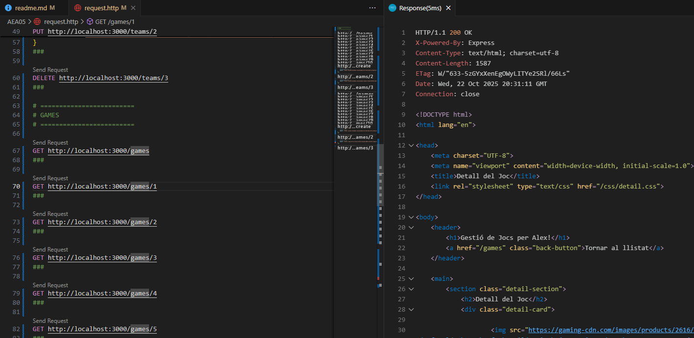
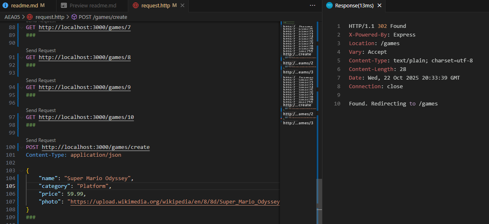
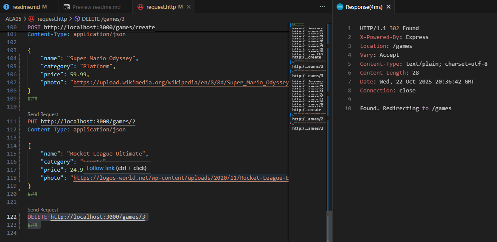

# Documentació de Rutes - Gestió de Teams i Games

Aquest projecte gestiona **equips de Fórmula 1** (`teams`) i **jocs** (`games`) amb funcionalitats CRUD (Crear, Llegir, Actualitzar, Esborrar). La informació es desa en un fitxer JSON (`db/db.json`).

---

## **Teams (Equips)**

### **Rutes principals**
| Mètode | Ruta                 | Descripció |
|--------|--------------------|------------|
| GET    | `/teams`            | Llista tots els equips. Renderitza `teams.ejs`. |
| GET    | `/teams/:id`        | Mostra els detalls d'un equip específic (`team`). Renderitza `team.ejs`. |
| GET    | `/teams/create`     | Mostra el formulari per crear un nou equip. Renderitza `create_team.ejs`. |
| POST   | `/teams/create`     | Crea un nou equip amb les dades del formulari i redirigeix a `/teams`. |
| GET    | `/teams/editTeam/:id` | Mostra el formulari per editar un equip existent. Renderitza `edit_team.ejs`. |
| PUT    | `/teams/:id`        | Actualitza les dades d'un equip existent i redirigeix a `/teams`. |
| DELETE | `/teams/:id`        | Esborra un equip específic i redirigeix a `/teams`. |

---

## **Games (Jocs)**

### **Rutes principals**
| Mètode | Ruta                 | Descripció |
|--------|--------------------|------------|
| GET    | `/games`            | Llista tots els jocs. Renderitza `games.ejs`. |
| GET    | `/games/:id`        | Mostra els detalls d'un joc específic (`game`). Renderitza `game.ejs`. |
| GET    | `/games/create`     | Mostra el formulari per crear un nou joc. Renderitza `create_game.ejs`. |
| POST   | `/games/create`     | Crea un nou joc amb les dades del formulari i redirigeix a `/games`. |
| GET    | `/games/editGame/:id` | Mostra el formulari per editar un joc existent. Renderitza `edit_game.ejs`. |
| PUT    | `/games/:id`        | Actualitza les dades d'un joc existent i redirigeix a `/games`. |
| DELETE | `/games/:id`        | Esborra un joc específic i redirigeix a `/games`. |

---

## **Explicació del funcionament**

1. **Lectura i escriptura:**  
   Les dades es llegeixen i s’escriuen a `db/db.json` utilitzant `fs.readFileSync` i `fs.writeFileSync`.

2. **Formularis de creació i edició:**  
   - Els formularis POST i PUT envien les dades amb `name`, `country`/`category`, `worldChampionships`/`price` i `photo`.
   - La ruta POST `/create` afegeix un nou element amb un `id` incremental.
   - La ruta PUT `/id` actualitza les propietats de l’element seleccionat.

3. **Eliminació d’elements:**  
   - La ruta DELETE `/id` elimina l’element del JSON i redirigeix a la llista corresponent (`/teams` o `/games`).

4. **Redireccions:**  
   - Després de crear, editar o esborrar, l’usuari és redirigit automàticament a la llista corresponent.
   - Les rutes GET redirigeixen a formularis específics si cal crear o editar.

5. **Renderització amb EJS:**  
   - Cada ruta GET utilitza un template `.ejs` i envia les dades necessàries (`user`, `data`, `team`/`game`, etc.).
   - Les imatges (`photo`) es mostren amb un preview a les pàgines d’edició i detall.

---

## **Observacions** - Cal que el fitxer db/db.json tingui la següent estructura mínima:
```json
{
  "teams": [],
  "games": []
}
```
---

## **Proves REST CLIENT**

- **GET Equip 5**  
  Ruta: `http://localhost:3000/teams/5`  
  

- **Post Joc**  
  Ruta: `POST http://localhost:3000/games/create`  
  - Dades
  ```json
   {
      "name": "Super Mario Odyssey",
      "category": "Platform",
      "price": 59.99,
      "photo": "https://upload.wikimedia.org/wikipedia/en/8/8d/Super_Mario_Odyssey.jpg"
   }
   ```
 

- **Put Joc**  
  Ruta: `PUT http://localhost:3000/games/2`  
  - Dades
  ```json
   {
    "name": "Rocket League Ultimate",
    "category": "Sports",
    "price": 24.99,
    "photo": "https://logos-world.net/wp-content/uploads/2020/11/Rocket-League-Emblem.png"
   }
   ```
 

- **Delete Joc 3**  
  Ruta: `DELETE http://localhost:3000/games/3`  
  