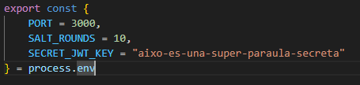

# Registre d'usuari amb Node.js

Aquesta aplicació permet fer un registre d'usuaris en el servidor Node.js

---

## Descripció

Aquest projecte permet als usuaris registrar-se amb un nom d'usuari i contrasenya. S'apliquen validacions bàsiques per assegurar que les dades siguin correctes i que els noms d'usuari siguin únics. La contrasenya s'emmagatzema de manera xifrada per garantir la seguretat.

---

## Tecnologies utilitzades

- **Node.js** com a entorn d'execució.
- **Express** per al servidor web.
- **DB-Local** per a l'emmagatzematge local de dades.
- **bcryptjs** per al xifrat segur de contrasenyes.
- **EJS** per al renderitzat de vistes.
- **JavaScript ES Modules** per a la modularització del codi.

---

## Funcionalitats principals

- Registre d'usuari amb validació de dades.
- Emmagatzematge segur de contrasenyes.
- Prevenció de registres duplicats amb noms d'usuari únics.
- Servidor amb vista de registre accessible des del navegador.

---

## Arquitectura del projecte

- **Servidor Express** que gestiona rutes per servir la pàgina de registre i per registrar usuaris.
- **Repositori d'usuaris** que valida i emmagatzema usuaris a la base de dades local.
- **Vista amb formulari de registre** renderitzada amb EJS.
- **Fitxers estàtics** per a CSS i scripts a la carpeta pública.

---

## Endpoints disponibles

- `GET /`  
  Mostra el formulari de registre.

- `POST /register`  
  Rep dades d'usuari per crear un nou registre. Retorna l’ID generat per a l’usuari o un error si el registre falla.

---

## Què hem vist fins ara?

Al llarg de les sessions realitzades fins ara, hem estudiat diferents conceptes vinculats amb el desenvolupament d’un servidor amb Node.js. Entre aquestes característiques hem vist: 
 - Creació del servidor en si mateix, amb express
 - Com configurar aquest, així com el port, endpoints...
 - Com crear diferents endpoints, ja sigui get, post, put i delete
 - Veure les diferents dependències que necessita un servidor node gràcies al package.json
 - Com crear una bbdd per poder emmagatzemar dades
 - Com fer les plantilles amb ejs per veure les diferents pagines del servidor

## Exemples dels conceptes

 - Exemple d'un endpoint  

 - Servidor en marxa 

 - Pagina de registre  

 - Arxiu de configuració  
